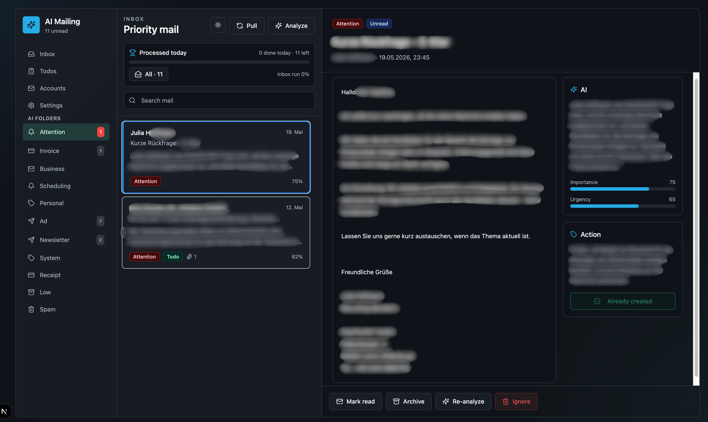

# MailTriage

Open-source, self-hosted AI mail triage. Connects to any IMAP account, analyzes unread emails using configurable OpenAI models (GPT-4o, GPT-4o-mini, and others), and syncs extracted action items directly to Todoist — built with Next.js 15, Prisma ORM, and PostgreSQL.



## Features

- **Multi-account IMAP/SMTP** — Connect Gmail, Outlook, IONOS, or any standard mail provider
- **AI triage** — Automatically categorize and score unread emails by importance and urgency
- **Smart summaries** — AI-generated summaries and suggested next actions for every email
- **Todo suggestions** — AI proposes actionable todos from emails; you decide what to keep
- **Todoist integration** — Push accepted todos directly to Todoist
- **Full-text search** — Search across subject, sender, body, AI summaries, and categories
- **Custom categories** — Create your own categories with custom AI instructions
- **Privacy-first** — All data stays on your machine; credentials encrypted at rest with AES-256-GCM
- **Read-state control** — Emails are never marked as read automatically; only explicit user action changes read state
- **Bilingual UI** — German and English interface with per-user language preference

## Tech Stack

| Layer | Technology |
|-------|-----------|
| Framework | Next.js 15 (App Router) |
| Language | TypeScript |
| Styling | Tailwind CSS |
| Database | PostgreSQL + Prisma ORM |
| Mail | IMAPFlow + Nodemailer |
| AI | OpenAI SDK (GPT-4o / configurable) |
| UI | Framer Motion, Lucide icons |

## Prerequisites

- **Node.js** ≥ 18
- **Docker** (recommended) — the bootstrap script auto-creates a PostgreSQL container. Alternatively, provide your own PostgreSQL instance.
- **OpenAI API key** — required for AI features. Get one at [platform.openai.com](https://platform.openai.com)

## Quick Start

```bash
npm run bootstrap
```

The bootstrap script will:
1. Load `OPENAI_API_KEY` from your shell environment (or prompt you)
2. Generate an `ENCRYPTION_KEY` for credential storage
3. Spin up a Docker PostgreSQL container (if Docker is available)
4. Run Prisma migrations
5. Start the dev server at `http://localhost:3000`

### Setup Only (no dev server)

```bash
npm run setup
```

### Manual Setup

1. Install dependencies:

   ```bash
   npm install
   ```

2. Copy `.env.example` to `.env` and fill in your values:

   ```bash
   cp .env.example .env
   ```

   Generate an encryption key:

   ```bash
   openssl rand -base64 32
   ```

3. Apply database migrations:

   ```bash
   npx prisma migrate dev
   ```

4. Start the app:

   ```bash
   npm run dev
   ```

## How It Works

1. **Connect** — Add your mail account via the Settings panel (IMAP + optional SMTP)
2. **Sync** — Pull inbox metadata and bodies over IMAP without altering read state
3. **Analyze** — Run AI analysis on unread emails to get categories, scores, summaries, and todo suggestions
4. **Act** — Mark read/unread, archive, create todos, push to Todoist, or re-analyze — all manually controlled

## Background Sync

For long-running deployments, enable automatic polling:

```env
MAIL_SYNC_AUTOSTART=true
SYNC_INTERVAL_SECONDS=180
```

This starts a cron-style poller via Next.js instrumentation.

## Project Structure

```
src/
├── app/
│   ├── api/            # REST API routes
│   │   ├── accounts/   # Mail account CRUD
│   │   ├── ai/         # Analysis + model listing
│   │   ├── mail/       # Sync, search, email endpoints
│   │   ├── settings/   # User preferences
│   │   └── todos/      # Todo management + Todoist sync
│   ├── page.tsx        # Main single-page app
│   └── globals.css
├── components/ui/      # Reusable UI components
└── lib/
    ├── ai/             # OpenAI prompts and analysis pipeline
    ├── db/             # Prisma client + helpers
    ├── jobs/           # Sync, analysis, and polling jobs
    ├── mail/           # IMAP, SMTP, and message parsing
    ├── security/       # AES-256-GCM encryption
    └── state/          # Serialization helpers
prisma/
├── schema.prisma       # Database schema
└── migrations/         # Migration history
scripts/
└── start.sh            # Bootstrap / setup script
```

## License

MIT
